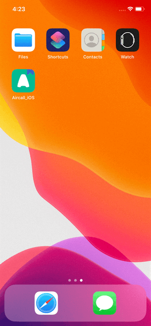
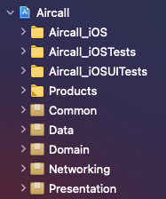
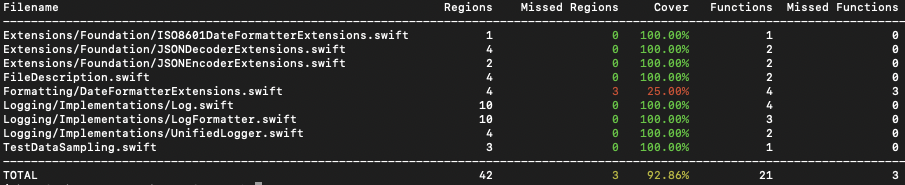
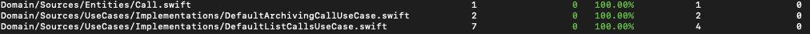
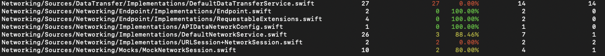
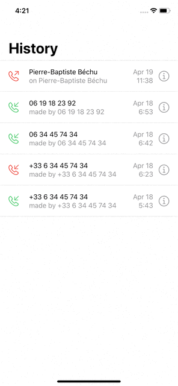

# Aircall

This is my solution to the test as part of the recruitment process with [Aircall](https://aircall.io/).

## Reference
The solution was built based on [this document](https://github.com/jobertcodes/aircall-ios-test).

## Overview

Simply put, the solution implements two use cases:
- Listing calls (filtering out the archived calls)
- Archive and unarchiving a call

## Getting started

### Prerequisites

* XCode 12.4

Other than that, nothing more is needed, all the dependencies are local packages that I created.  
Once the project is fully loaded by Xcode, you can go ahead and run it!

### Demo:

*Note the button on the top right changes to "unarchive" once the call is archived.*  
**There's a bug I didn't have time to fix, which causes the title to render again when updating the call, but using the large style.**  

## A brief outline of the architecture of your app:
I tried to implement the clean architecture as [described by Undle bob](https://blog.cleancoder.com/uncle-bob/2012/08/13/the-clean-architecture.html):

The project is structured so that there's only one main project containing an iOS target and local Swift Packages for each layer of the architecture:

The key point is that we can easily replace any of these layers with different implementations without breaking the app.
Potentially, this allows to replace the presentation layer with `UIKit` implementations, for example.

### Common
Is not part of the architecture, but it includes basic protocols and types used in the other packages.

### Domain
Contains definitions to the Domain layer, which contains *Entities*, *Use Cases* and *Repository Interfaces*.
The Domain layer is completely isolated and could be potentially reused within different projects.  
This architecture allows architects to easily and safely describe the structures that support *Use Cases* without being forced to use specific frameworks, tools and environments - something Uncle Bob called [Screaming-Architecture](https://blog.cleancoder.com/uncle-bob/2011/09/30/Screaming-Architecture.html). 

### Networking
Contains all the protocols and types related to the network infrastructure.

### Data
Contains *repository* implementations and *data sources*.
This layer depends on the *Domain* and *Networking* layers.

### Presentation
Corresponds to *UI* and *Presenters* on Uncle Bob's "onion" layers.
This layer depends only on the *Domain* layer.
This package was implemented using SwiftUI and MVVM as UI design pattern.
The navigation was implemented using core UIKit APIs though.

#### Other design patterns:
There are couple of other design patterns that I used, such as
* Dependency Injection
* Data Binding
* Abstract Factory

## Why you decided to use each third party libraries
I did not use any third party libraries.

## What was the most difficult part of the challenge?
- Time - I struggled to make time between my current job and other commitments I had.
- Learning SwiftUI and Combine - I only had a little personal experience with these frameworks but I wanted to invest time on them since I believe this would be appreciated at Aircall.

## Estimate your percentage of completion and how much time you would need to finish
I missed one part of the requirement, which was to archive a call from the List page.
My idea was to implement that with the swipe gesture to display the actions but I didn't have time to learn about it.
But one simple solution would be to just add a button to each row to trigger the archive. I believe that shouldn't take longer than an hour to complete.

## Unit tests
I tried to use the TDD approach but couldn't stick to it 100% of the time.  
Anyways, I think I still could achieve a pretty good amount of code coverage for the main packages:

## Documentation
Every package is documented, except for the *Presentation*:
- Common: 
- Domain: 
- Networking: 
- Data: 

## Extras:

### Localization support
All the strings used are localized. Currently, only English is supported. But adding support to other languages is very simple and easy.

### Type-safe access to String, Images and other assets
I used [SwiftGen](https://github.com/SwiftGen/SwiftGen) to generate all the code related.

### Code conventions
I used [SwifLint](https://github.com/realm/SwiftLint) to enforce code conventions are followed everywhere.

### Dark mode

### Basic dynamic type support
Not perfect, but works ok with the basics, could be improved to dynamically adjust other UI components.  
<kbd>command</kbd>+<kbd>option</kbd>+<kbd>+</kbd> to increase font sizes.  
<kbd>command</kbd>+<kbd>option</kbd>+<kbd>-</kbd> to decrease font sizes.  

### Custom icon

## Author

[Jobert Sá](https://github.com/jobertcodes) - jobert@codespark.io
